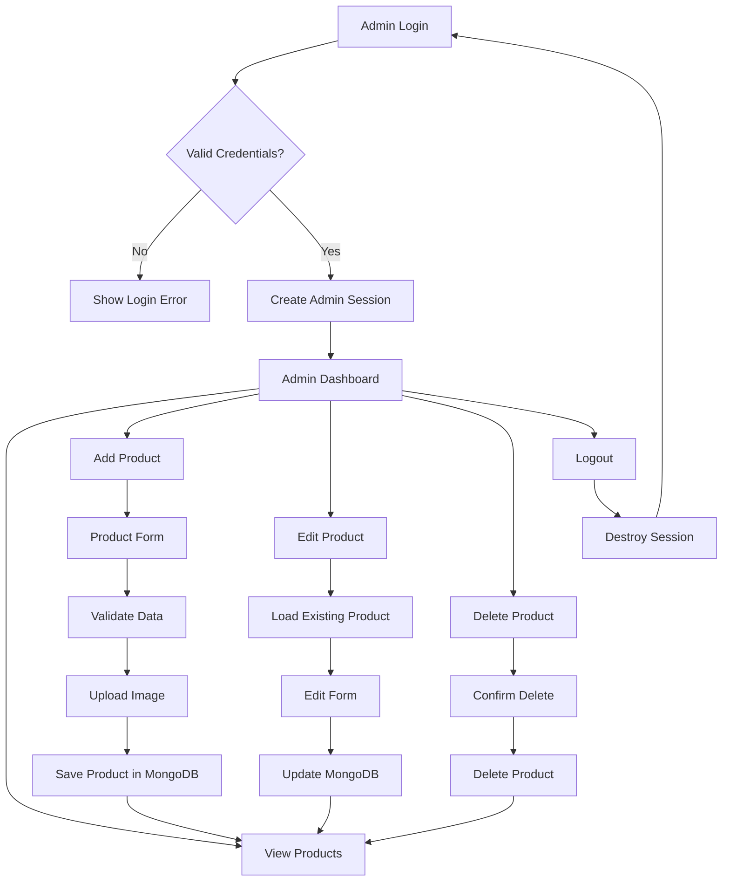

Yes. For your **GiftAura+ B.Sc/MSc college project**, this is a good next phase. Keep the admin system simple, but structure it properly so you can later expand it.

Your current architecture is already suitable for adding this:

```text
FastAPI
   │
   ├── Customer Authentication
   │      ├── Register
   │      ├── Login
   │      └── Logout
   │
   └── Admin Authentication
          ├── Admin Login
          ├── Admin Session
          ├── Admin Dashboard
          ├── Add Product
          ├── Edit Product
          ├── Delete Product
          └── Product Statistics
```

## 1. What we should build now

### Admin login

Create a separate admin login:

```text
/admin/login
```

Admin enters:

* Username/email
* Password

On successful login:

```text
/admin/login
      ↓
validate admin
      ↓
create admin session
      ↓
/admin/dashboard
```

If somebody tries:

```text
/admin/dashboard
/admin/products
/admin/products/add
```

without an admin session:

```text
→ /admin/login
```

---

# 2. Admin dashboard

The dashboard can be deliberately simple.

```text
┌─────────────────────────────────────────────┐
│ GiftAura+ Admin                    Logout   │
├─────────────────────────────────────────────┤
│                                             │
│  Total Products        Categories           │
│       42                    6               │
│                                             │
├─────────────────────────────────────────────┤
│                                             │
│  Category Summary                           │
│                                             │
│  Birthday          10 products              │
│  Anniversary        8 products              │
│  Wedding            7 products              │
│  Personalized       9 products              │
│  Corporate          5 products              │
│  Others             3 products              │
│                                             │
├─────────────────────────────────────────────┤
│                                             │
│        [+ Add Product]                      │
│                                             │
└─────────────────────────────────────────────┘
```

For a college project, **don't over-engineer analytics** yet.

---

# 3. Product management

Admin should have:

```text
/admin/products
```

Something like:

```text
Products
──────────────────────────────────────────────

[ + Add Product ]

Image       Product       Category       Price

image       Photo Frame   Birthday       ₹599
image       Gift Box      Anniversary    ₹899
image       Mug           Personalized   ₹399

                         Edit | Delete
```

The important operations are:

* Add
* View
* Edit
* Delete

That's your basic CRUD.

---

# 4. Add Product

When admin clicks:

**Add Product**

go to:

```text
/admin/products/add
```

Form:

```text
Product Name
[________________________]

Product Description
[________________________]
[________________________]

Product Image
[ Choose File ]

Price
[________________________]

Category
[ Select Category ▼ ]

[ Add Product ]
```

When submitted:

```text
POST /admin/products/add
```

The backend saves:

```text
products
├── name
├── description
├── image
├── price
├── category
└── created_at
```

Then:

```text
Product added
      ↓
/admin/products
```

---

# 5. Category handling

For your current project, I'd **avoid creating a separate category CRUD system**.

Just maintain predefined categories initially:

```text
Birthday
Anniversary
Wedding
Personalized
Corporate
Festive
```

Then the product form contains:

```html
<select name="category">
    <option value="Birthday">Birthday</option>
    <option value="Anniversary">Anniversary</option>
    <option value="Wedding">Wedding</option>
    <option value="Personalized">Personalized</option>
    <option value="Corporate">Corporate</option>
    <option value="Festive">Festive</option>
</select>
```

This is much easier for a college project.

Later, if needed, we can create a proper `categories` collection.

---

# 6. MongoDB structure

Since your current GiftAura+ backend uses MongoDB, I'd use two collections:

```text
GiftAuraDB
│
├── users
│
├── admins
│
└── products
```

### `admins`

Example:

```json
{
    "_id": "...",
    "username": "admin",
    "email": "admin@giftaura.com",
    "password_hash": "...",
    "role": "admin"
}
```

**Never store the actual admin password.**

Use the same password hashing approach you're already using in `AuthService`.

---

### `products`

Example:

```json
{
    "_id": "...",
    "name": "Personalized Photo Frame",
    "description": "A beautiful customized photo frame.",
    "image": "/static/images/products/photo-frame.jpg",
    "price": 799,
    "category": "Personalized",
    "created_at": "2026-08-20T10:30:00"
}
```

---

# 7. Recommended new project structure

I'd modify your current structure to:

```text
gap
│
├── database
│   ├── config.py
│   ├── connection.py
│   └── init_db.py
│
├── models
│   ├── user.py
│   ├── admin.py
│   └── product.py
│
├── repositories
│   ├── user_repository.py
│   ├── admin_repository.py
│   └── product_repository.py
│
├── services
│   ├── auth_service.py
│   ├── admin_service.py
│   └── product_service.py
│
├── routes
│   ├── auth_routes.py
│   ├── admin_routes.py
│   └── product_routes.py
│
├── static
│   ├── css
│   │   ├── style.css
│   │   └── admin.css
│   │
│   ├── images
│   │   └── products
│   │
│   └── js
│
├── templates
│   │
│   ├── admin
│   │   ├── login.html
│   │   ├── dashboard.html
│   │   ├── products.html
│   │   ├── add_product.html
│   │   └── edit_product.html
│   │
│   ├── auth
│   │   ├── login.html
│   │   └── register.html
│   │
│   ├── components
│   │
│   ├── home
│   ├── product
│   ├── shop
│   ├── about
│   ├── contact
│   │
│   └── shared
│       ├── base.html
│       ├── navbar.html
│       └── footer.html
│
├── main.py
├── requirements.txt
└── README.md
```

---

# 8. Routes

I'd keep the routes very clear.

### Admin authentication

```text
GET  /admin/login
POST /admin/login
POST /admin/logout
```

### Dashboard

```text
GET /admin/dashboard
```

### Product management

```text
GET  /admin/products
GET  /admin/products/add
POST /admin/products/add

GET  /admin/products/edit/{product_id}
POST /admin/products/edit/{product_id}

POST /admin/products/delete/{product_id}
```

Notice that I recommend **POST for delete**, rather than:

```text
GET /admin/products/delete/123
```

You don't want a crawler, accidental link click, or browser prefetch to delete a product.

---

# 9. Admin session

Because you're using FastAPI, we can use session middleware.

Conceptually:

```text
Admin Login
     │
     ▼
Check username/password
     │
     ▼
Password hash verification
     │
     ▼
request.session["admin_id"] = admin_id
request.session["admin_logged_in"] = True
     │
     ▼
Dashboard
```

Then every admin route checks:

```text
Is admin_logged_in == True?
       │
       ├── YES → continue
       │
       └── NO  → /admin/login
```

This is important because hiding the admin link from the navbar **is not authentication**.

---

# 10. Product flow

The complete flow becomes:



---

# 11. Dashboard statistics

The dashboard doesn't need complicated analytics.

We can calculate:

```text
Total Products
```

with:

```python
products.count_documents({})
```

And category counts:

```python
products.count_documents({"category": "Birthday"})
products.count_documents({"category": "Wedding"})
products.count_documents({"category": "Anniversary"})
```

Or preferably use a MongoDB aggregation:

```text
products
    │
    ▼
$group by category
    │
    ▼
Birthday → 10
Wedding → 7
Anniversary → 8
...
```

For a small college project, either is fine. Aggregation is cleaner if you want to demonstrate MongoDB capabilities.

---

# 12. Image upload

For now, **don't put image binary data directly into MongoDB**.

Use:

```text
static/images/products/
```

For example:

```text
static/images/products/
├── photo-frame.jpg
├── gift-box.jpg
├── birthday-mug.jpg
└── wedding-hamper.jpg
```

MongoDB stores:

```json
{
    "image": "/static/images/products/photo-frame.jpg"
}
```

This keeps the database simple.

Later, for production deployment, we'd move images to object storage rather than storing uploads on the application server.

---

# 13. One important security decision

Don't make the admin account work like this:

```python
if username == "admin" and password == "admin123":
```

That is okay only for a throwaway demo, but it creates a bad architecture.

Instead:

```text
admins collection
      ↓
find admin
      ↓
verify password hash
      ↓
create session
```

Also, don't trust:

```text
/admin/dashboard?admin=true
```

or any client-provided admin flag.

The server-side session must be the authority.

---

# 14. What I'd implement first

Don't build everything simultaneously.

### Phase A — Admin authentication

```text
admin.py
admin_repository.py
admin_service.py
admin_routes.py
admin/login.html
```

and session protection.

### Phase B — Dashboard

```text
dashboard.html
```

with:

```text
Total Products
Category Counts
```

### Phase C — Product CRUD

```text
product.py
product_repository.py
product_service.py
```

then:

```text
products.html
add_product.html
edit_product.html
```

### Phase D — Image upload

Add:

```text
UploadFile
```

and save the image to:

```text
static/images/products/
```

### Phase E — Customer shop integration

Finally, change your existing:

```text
shop.html
product_details.html
category_section.html
best_sellers_section.html
```

to load products from MongoDB instead of hardcoded products.

That last part is important: **the admin panel should become the source of truth for the customer-facing shop.**

So the final architecture will be:

```text
                  MongoDB
                     │
              ┌──────┴──────┐
              │             │
          Admin Panel    Customer Site
              │             │
         Add/Edit/Delete   Read Products
              │             │
              └──────┬──────┘
                     │
                  products
```

For your current college-project scope, this is enough to demonstrate **authentication + authorization + session management + CRUD + file upload + MongoDB aggregation + dynamic frontend integration** without turning GiftAura+ into an unnecessarily large system.

**What could go wrong:** the biggest risks are accidentally exposing `/admin/*` without session checks, storing plaintext passwords, allowing unsafe filenames during image upload, using GET for destructive operations, and eventually relying on local `static/` uploads when you deploy to a platform with ephemeral storage.
